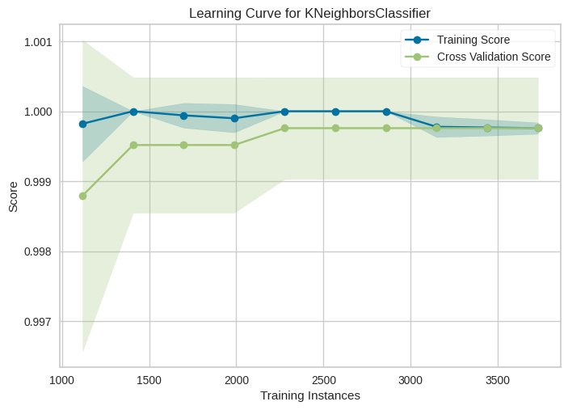

# Welcome to the Seismic Detection Model! 🌌

Dive into our cutting-edge model for detecting seismic signals! With impressive performance metrics and stunning visualizations, this project showcases how technology can enhance our understanding of seismic activity. 🚀

## Key Features

- **High Accuracy**: The model consistently achieves high training and cross-validation scores (around 0.999-1.000), indicating excellent performance.
- **Robustness**: The close alignment of training and validation scores suggests that the model is not overfitting.

## Performance Visualization

### Graph Explanation

This graph illustrates how the model's performance changes as the number of training instances increases. It effectively demonstrates the model's capacity to generalize well with an increasing amount of data.

## Guide to Using a Model in a `.ipynb` Repository

To use the model contained in the `.ipynb` file, follow these steps:

### 1. Open the Jupyter Notebook

1. Start Jupyter Notebook in your working environment.
2. Navigate to the location of the `.ipynb` file containing the model.
3. Click on the file to open it.

### 2. Run the Notebook Cells

Once the notebook is open, you can run the cells in the following ways:

- **Run a single cell**: Select the cell you want to execute and press `Shift + Enter`. This will run the current cell and select the next one.
- **Run all cells**: Go to the menu and select `Cell` -> `Run All`. This will execute all cells in the notebook in order, from the first to the last.

### Note

Make sure that all necessary dependencies and libraries are installed before running the notebook. You can refer to the `requirements.txt` file to see which packages are needed and ensure they are installed in your environment.

